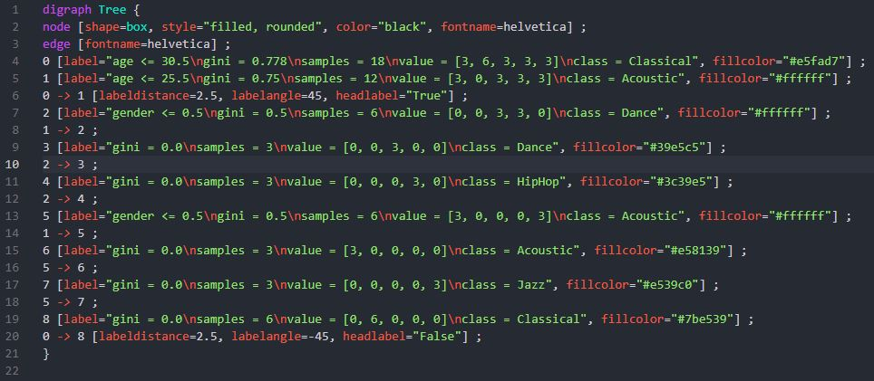
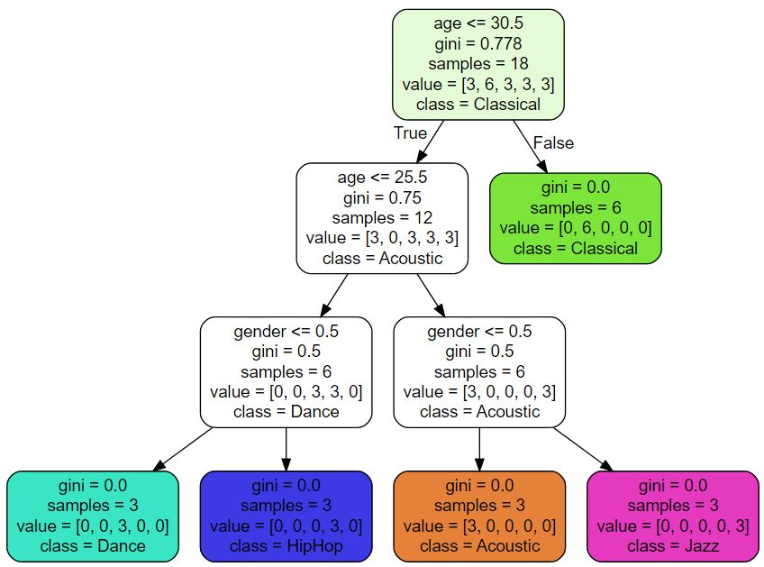

# music-genres

# Simple 'machine learning' program utilizing Anaconda to access Jupyter Notebook
## We use Pandas for our data visualization utilizing the sklearn library to create a graphical visualization of a decision tree

Download Anaconda

Through Anaconda Navigator open Jupyter Notebook

Create new folder to host project

Create Python notebook in folder

Select .csv file of choice and move into folder with Python notebook

### What is a .ipynb file?
It is an organized file of .py files which holds each individual cell and it's output, so we do not have to run
all files at once when working with large data sets

Takes music.csv, splits into two sets, and asks for a prediction using predict()
Takes .csv file, and uses .metrics method which will train, test, and split our data using a 
comparison between predictions and our real data (y_test) we get an accuracy score between 0 - 1

Now that we have created our music-recommender.joblib file which is in our project directory, we can load it onto any prediction parameter
This is called persisting

Now we utilize tree to create our data visualization

This will have created a music-recommender.dot file, we can now put this into a VSCode format
Install Graphviz(dot) language support for VSCode

